# About me 
### Full name: Anani Thierry Kassa
### Student ID: 041140713

## Screenshots:

### Disclaimer: Can't use the US East region - see image below
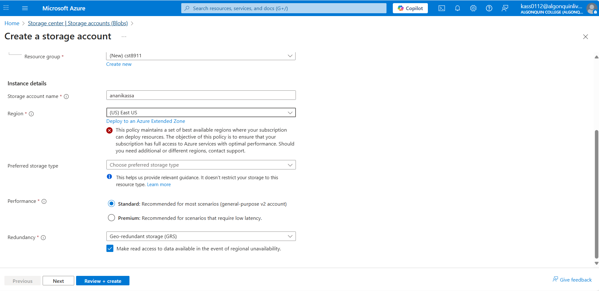

### Step 1 - Screenshot:
Screenshot should show the creation of Storage account, in the specified region and settings. Go to the storage account you created and Overview tab and take a screenshot showing those settings.
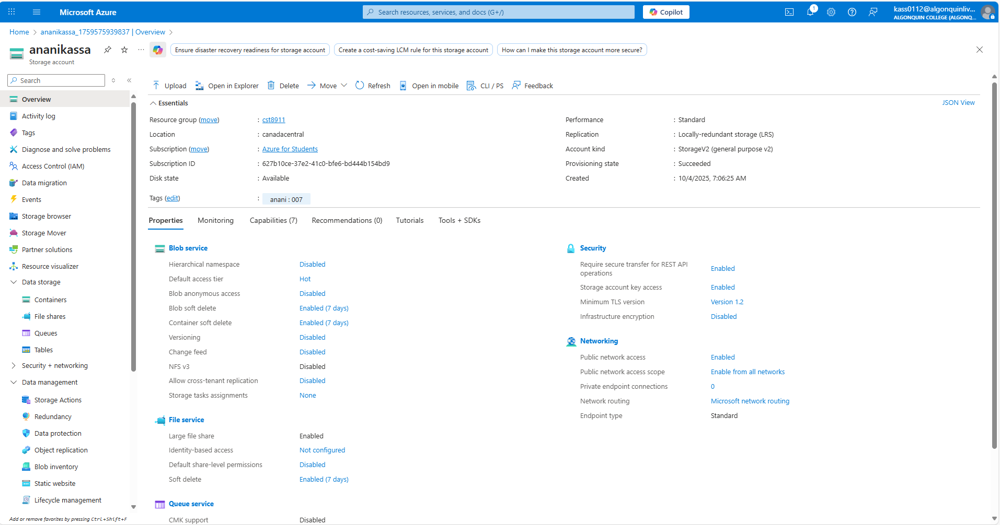

### Step 2 – Screenshot:
Screenshot should show that csv file has been added to the container
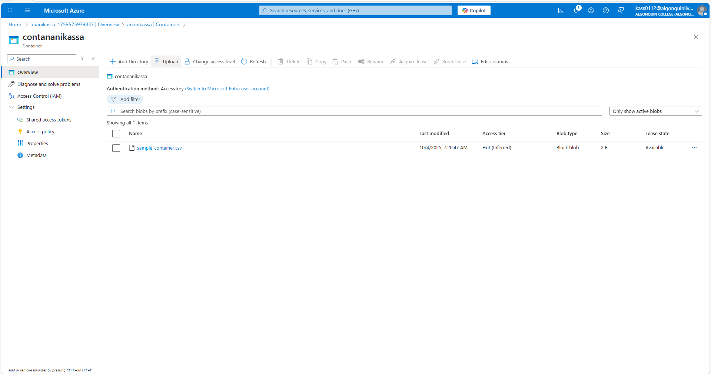

### Step 3 - Screenshot:
Screenshot should show that file share has been created
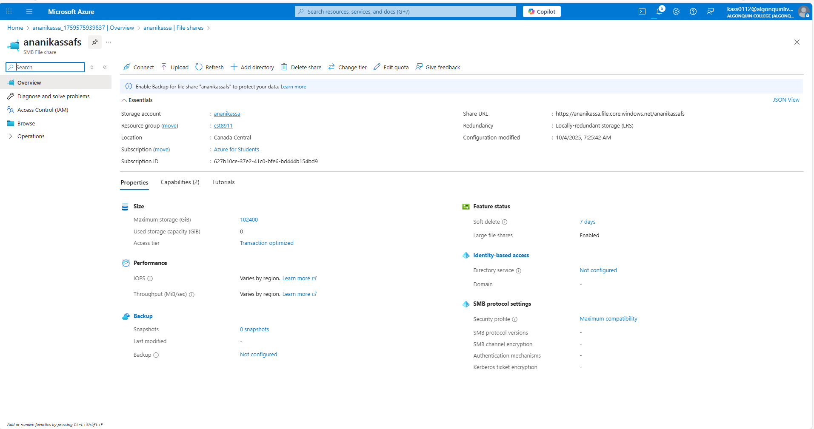

### Step 4 – Screenshot:
Screenshot should show terminal with command downloading csv file and file being downloaded, show entirety of the output
Screenshot should show the csv file in your file explorer or whatever folder you’ve downloaded it to
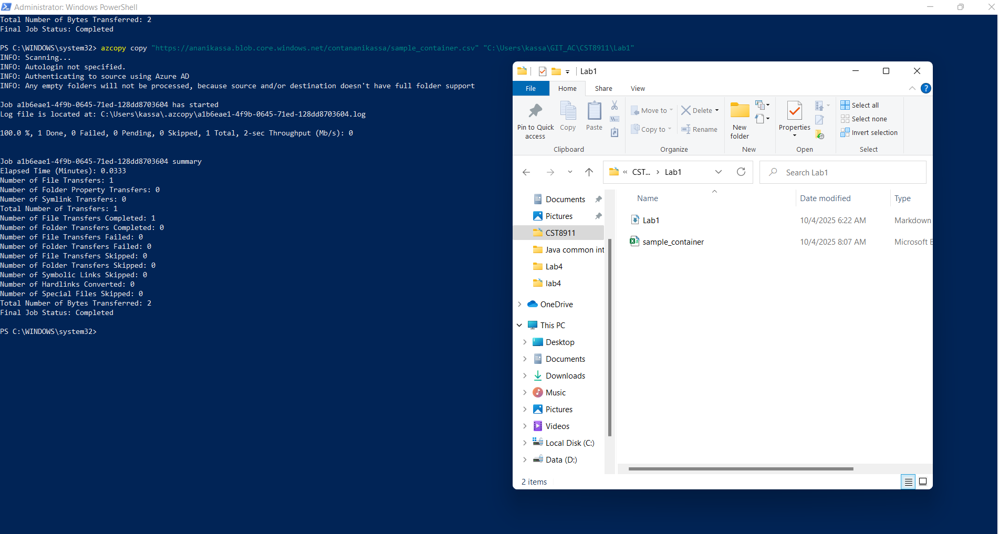

### Step 5 – Screenshot:
- Screenshot should show you uploading the .json file via SAS token, so show where you found the SAS token in the azure portal
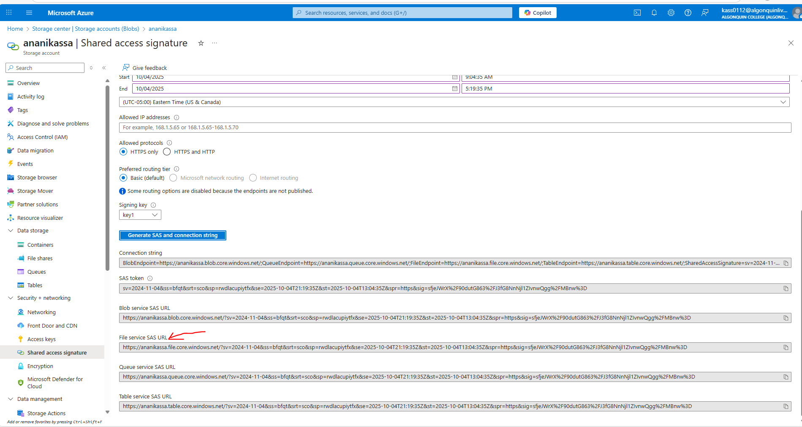
- Screenshot of command uploading .json file via SAS token and successful output command
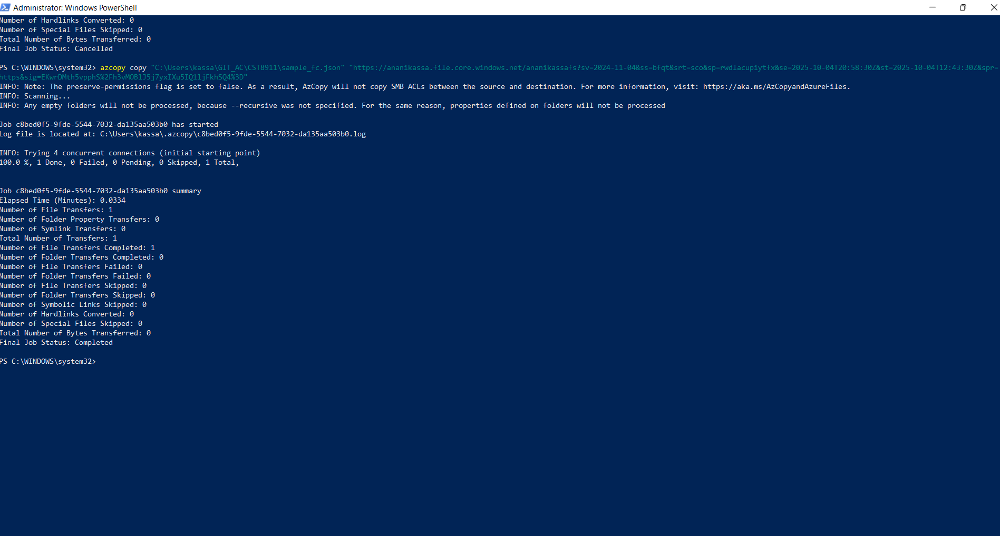
Screenshot of the azure portal showing file has been uploaded
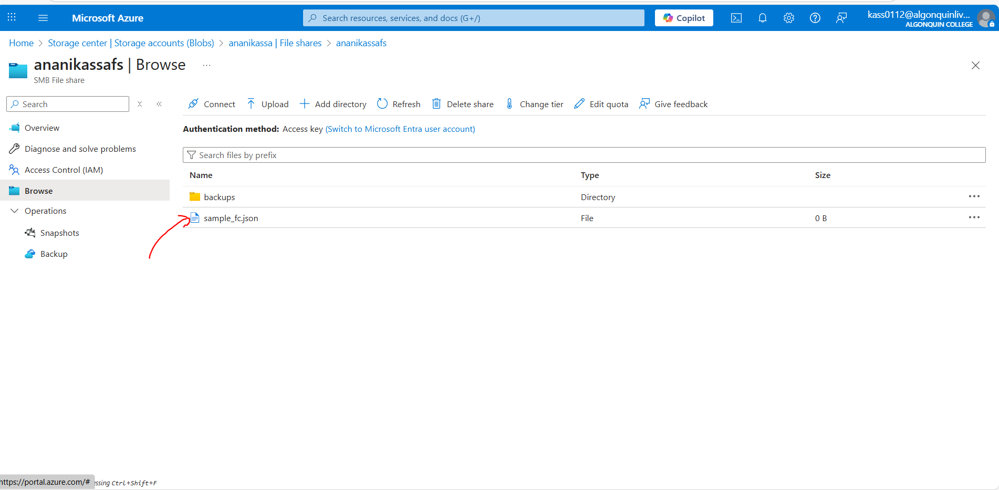

### Step 6 – Screenshot:
Screenshot should show your current IAM policy that you have for that storage account
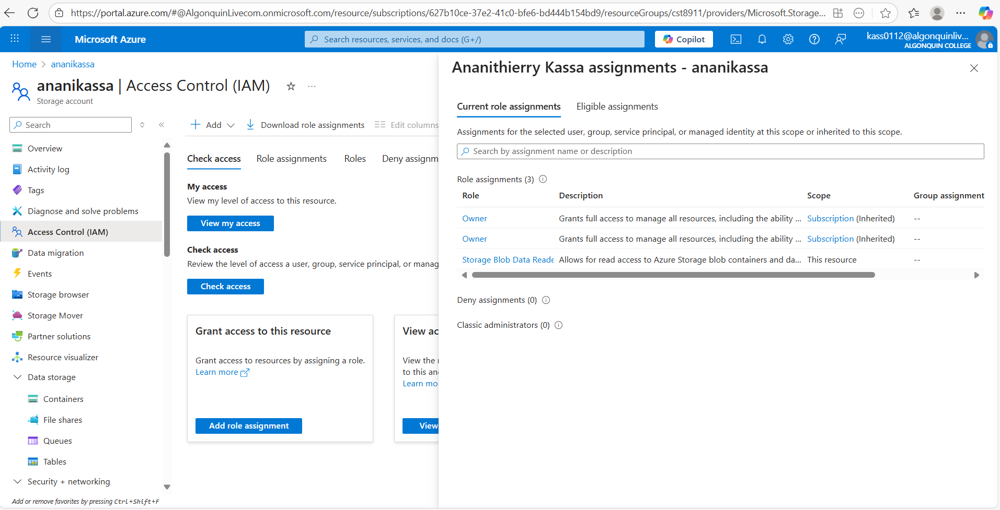

### Step 7 – Screenshot:
Show each step of giving yourself the correct role
 - Select the role 
 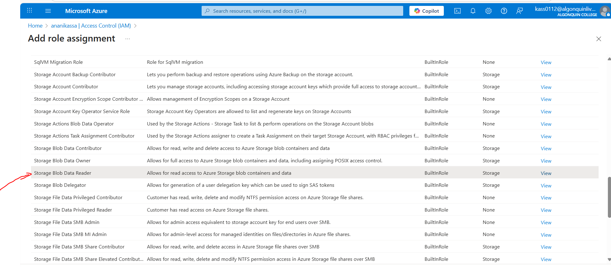

 - Add a member 
 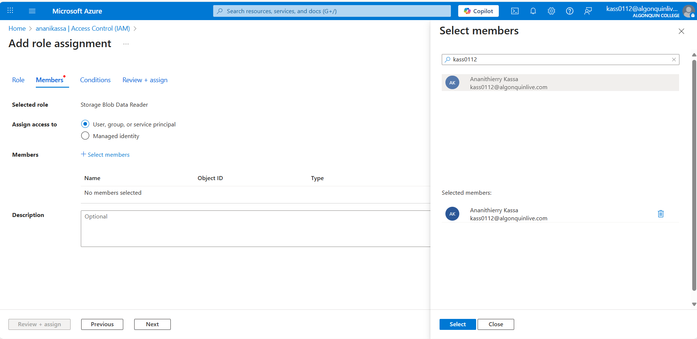

 - Review + assign
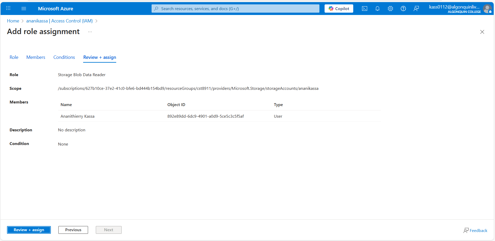

### Step 8 – Screenshot:
- Show you deleting storage account
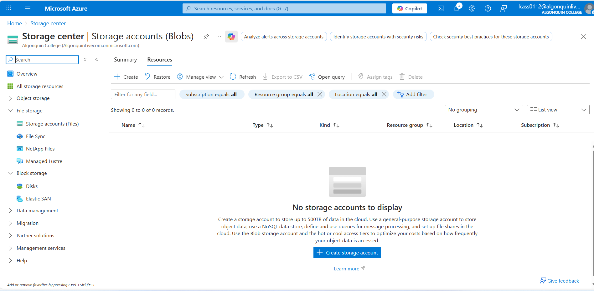
- resource group and successful deleted message
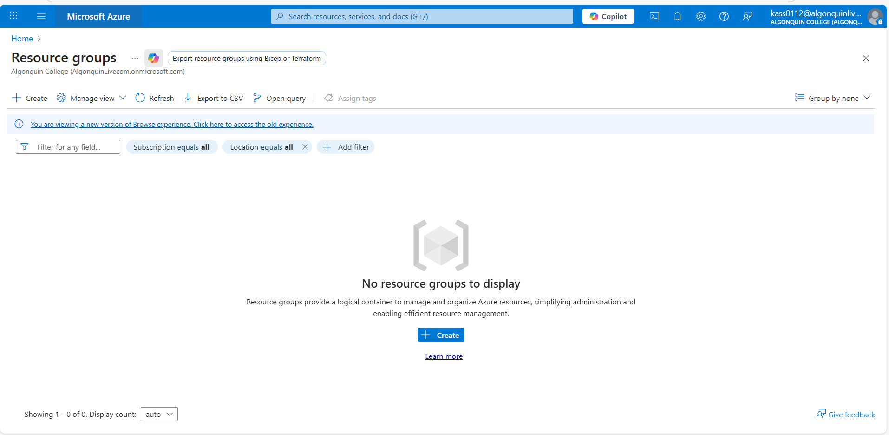