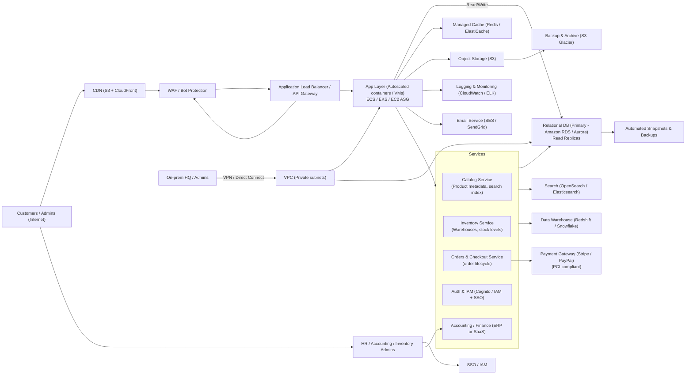

```mermaid
flowchart LR
%% Edge
Internet["Customers / Admins (Internet)"]
CF["CDN (S3 + CloudFront)"]
WAF["WAF / Bot Protection"]
ALB["Application Load Balancer / API Gateway"]


%% App tier
ALB --> AppAuto["App Layer (Autoscaled containers / VMs)\nECS / EKS / EC2 ASG"]
AppAuto -->|Read/Write| RDS["Relational DB (Primary - Amazon RDS / Aurora)\nRead Replicas"]
AppAuto --> Cache["Managed Cache (Redis / ElastiCache)"]
AppAuto --> FileStore["Object Storage (S3)"]


%% Microservices
subgraph Services
Catalog["Catalog Service\n(Product metadata, search index)"]
Inventory["Inventory Service\n(Warehouses, stock levels)"]
Orders["Orders & Checkout Service\n(order lifecycle)"]
Auth["Auth & IAM (Cognito / IAM + SSO)"]
Accounting["Accounting / Finance (ERP or SaaS)"]
end
AppAuto --> Services
Services --> RDS
Services --> ES["Search (OpenSearch / Elasticsearch)"]
Services --> Analytics["Data Warehouse (Redshift / Snowflake)"]
FileStore --> Backup["Backup & Archive (S3 Glacier)"]


%% Admin / Internal
Office["On-prem HQ / Admins"]
Office -->|VPN / Direct Connect| VPC["VPC (Private subnets)"]
VPC --> AppAuto
VPC --> RDS


%% Security & Observability
ALB --> WAF
AppAuto --> Logs["Logging & Monitoring (CloudWatch / ELK)"]
RDS --> Snapshots["Automated Snapshots & Backups"]


%% Third-party
Orders --> Payment["Payment Gateway (Stripe / PayPal)\n(PCI-compliant)"]
AppAuto --> Email["Email Service (SES / SendGrid)"]


%% Admin consoles
Admin["HR / Accounting / Inventory Admins"]
Admin --> SSO["SSO / IAM"]
Admin --> Accounting


Internet --> CF --> WAF --> ALB
Internet --> Admin
```