# About me 
### Full name: Anani Thierry Kassa
### Student ID: 041140713

## Screenshots:

### Disclaimer: Can't use the US East region - see image below
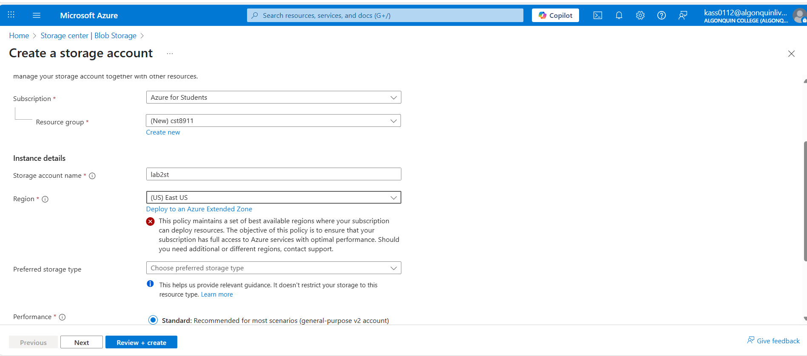

### Step 1: Storage account, overview tab screenshot, that essentially displays, name of storage account, region, and redundancy setting ie Locally redundant storage 
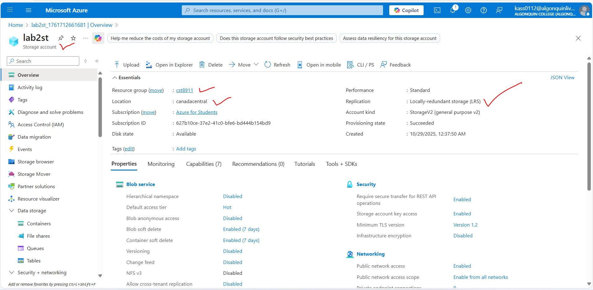

### Step 2: Screenshot of process of create azure function app, displaying the setting you selected. Need to show the runtime stack, version, region, and consumption hosting option selected
- create azure function
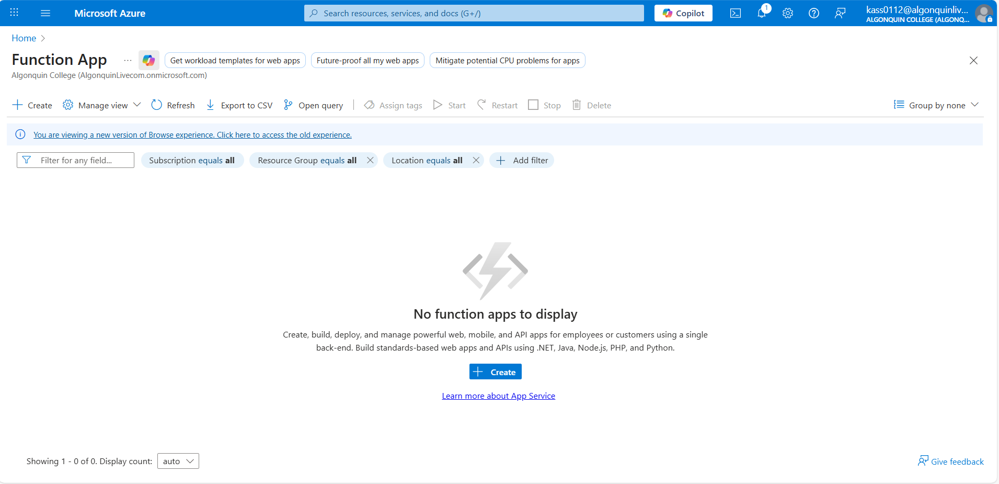
- consumption
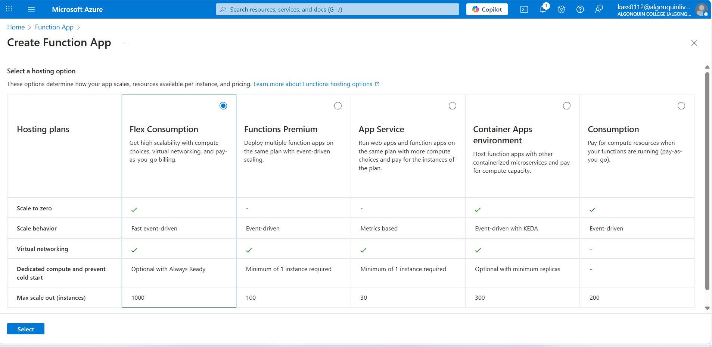
- runtime stack, version, region
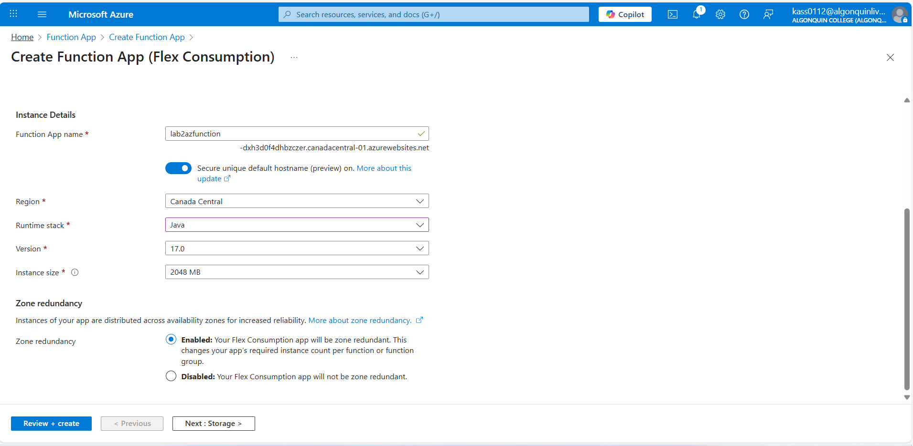
- azure function overview
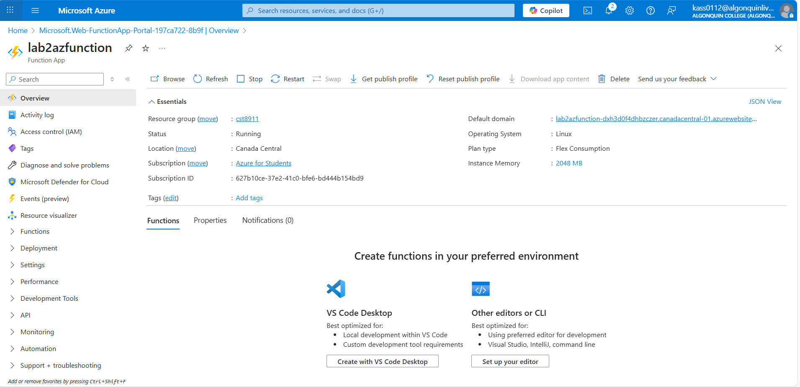

### Step 3: Screenshot of the process of creating the function app via azure portal. Ensure your storage account connection is the storage account created in step 1 
- As per using the java as runtime stack, I have to create an azure function using VS Code and deploy it over the azure portal. Note that the local.settings.json file contain the connection string to the storage account create in step 1.
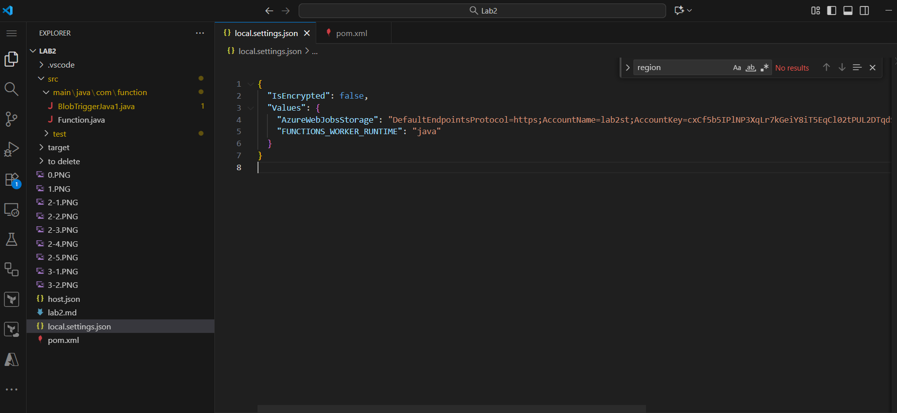

- The next steps has to deployed the azure function while ensuring that the pom.xml file generated by Maven has the right settings of the region, the runtime stack, etc. The deployment has been completed running commands in terminal.
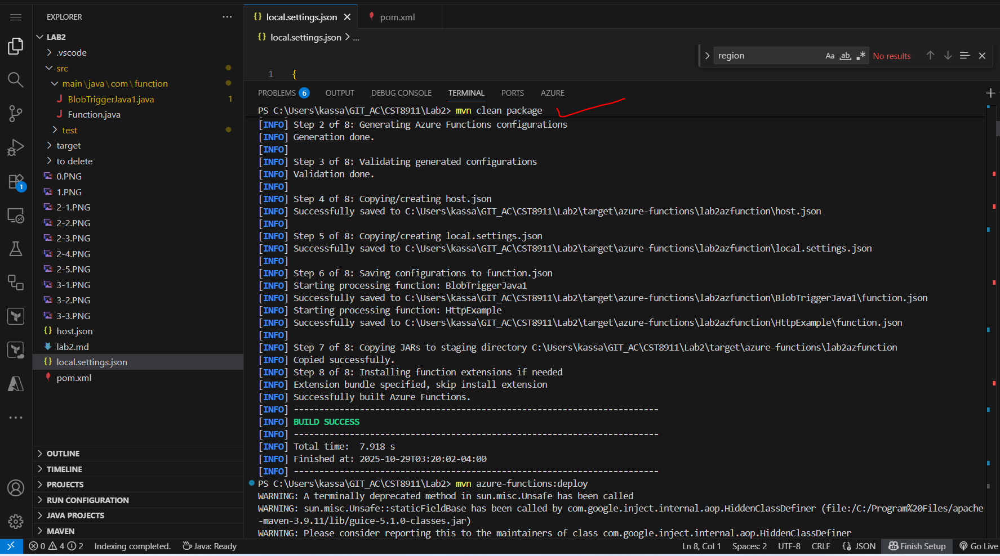

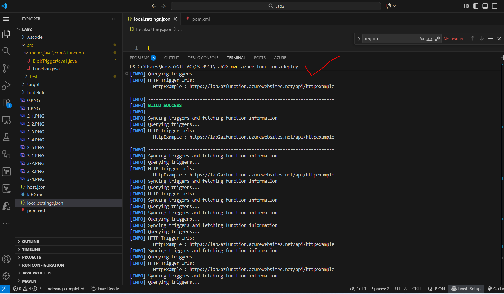

- Here is how it looks like in Azure portal 

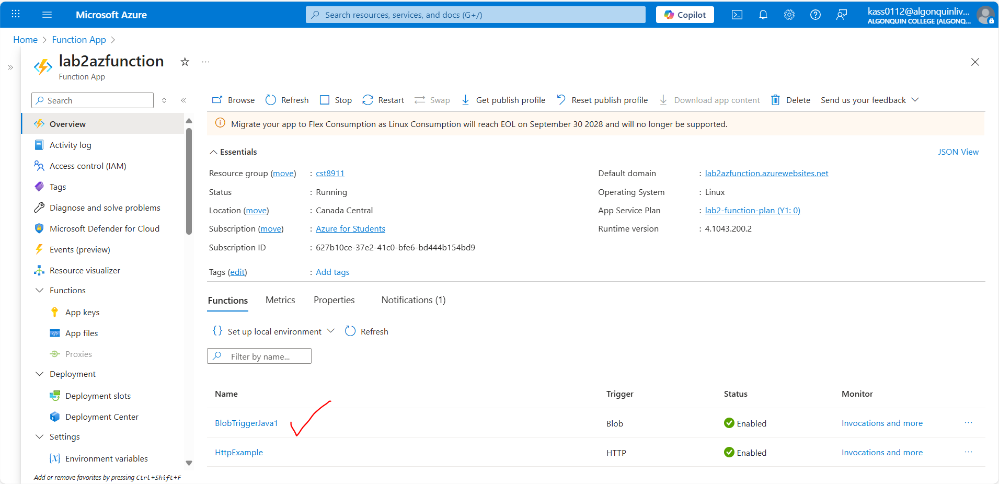

### Step 4:
- Screenshot of the code of the function 
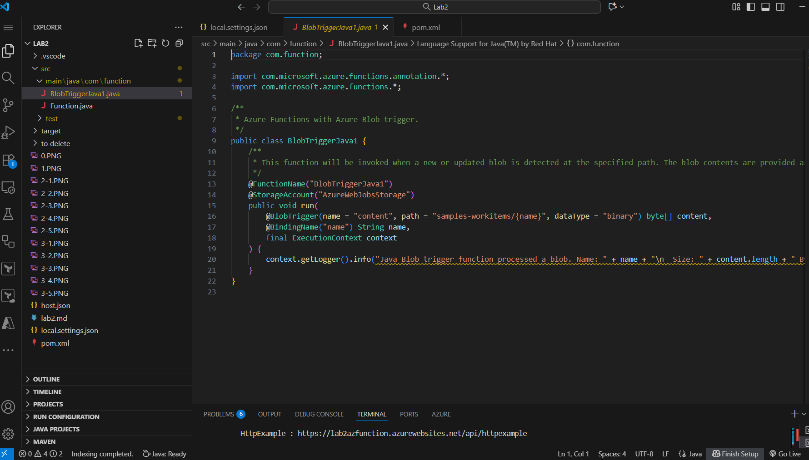

- Screenshot of the .json file
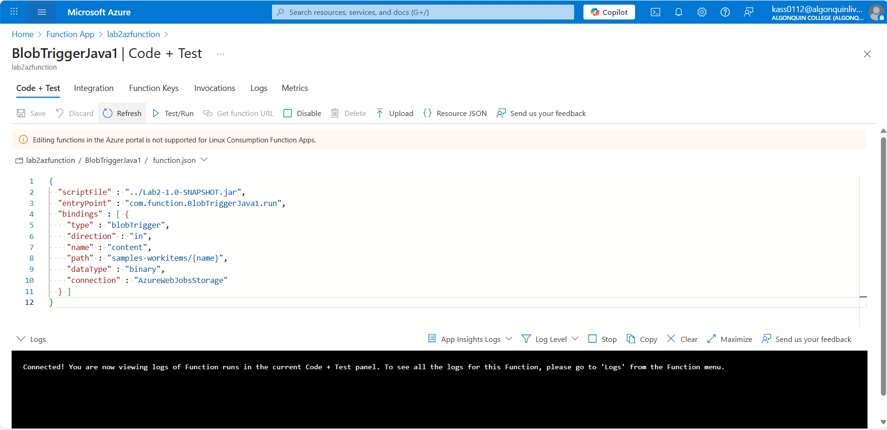

- Screenshot of the Test/run Input file
    - screenshot of Test/run using the BlobTriggerJava1 function
    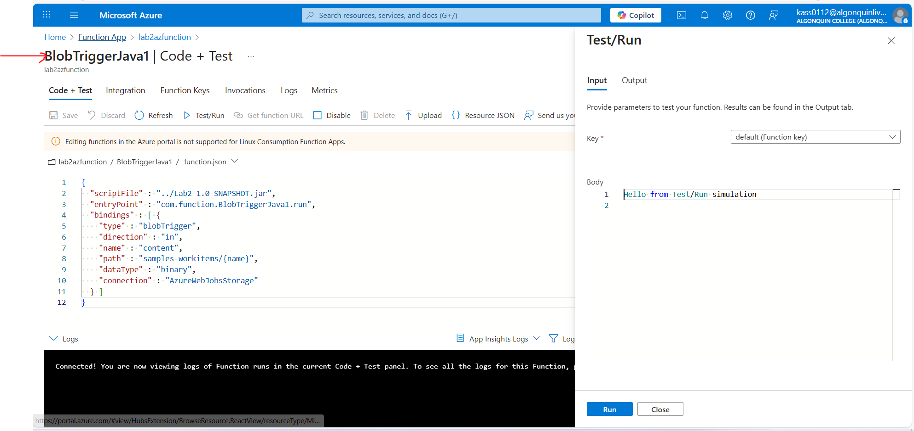
    - output Errors
    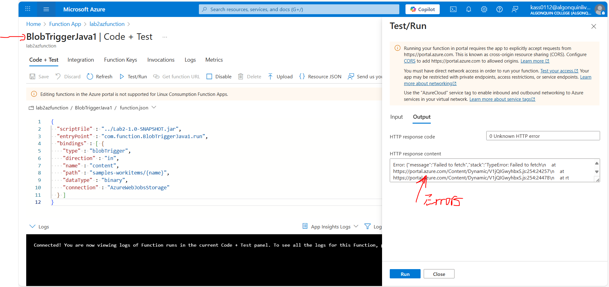

- Screenshot of the output: I show screenshots of the successfull triggered blob file using the logstream, invocations, and metrics
    - adding new file into the blob storage lab2st via the container samples-workitems
    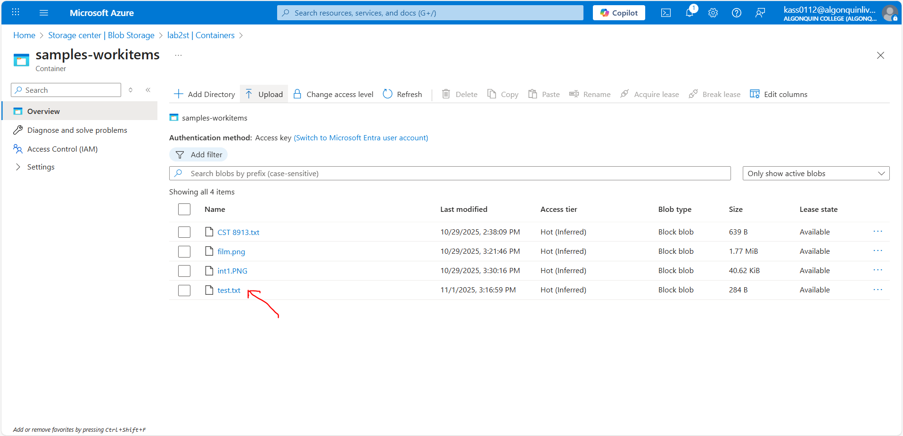
    - successfull logstream update
    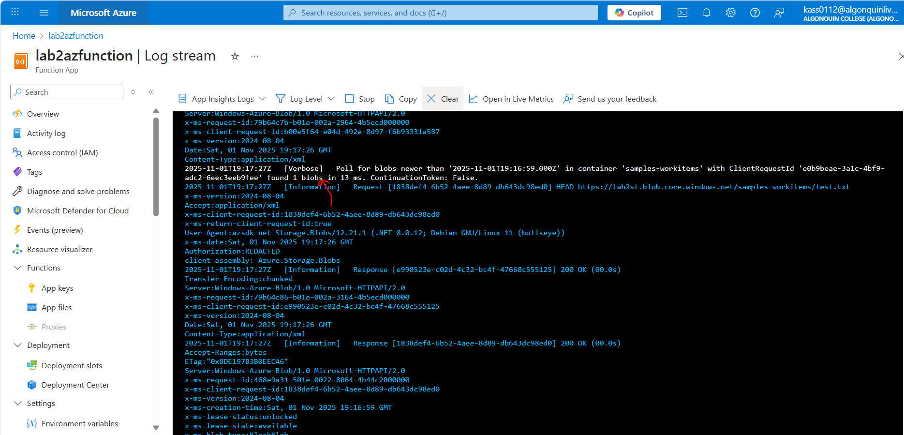
    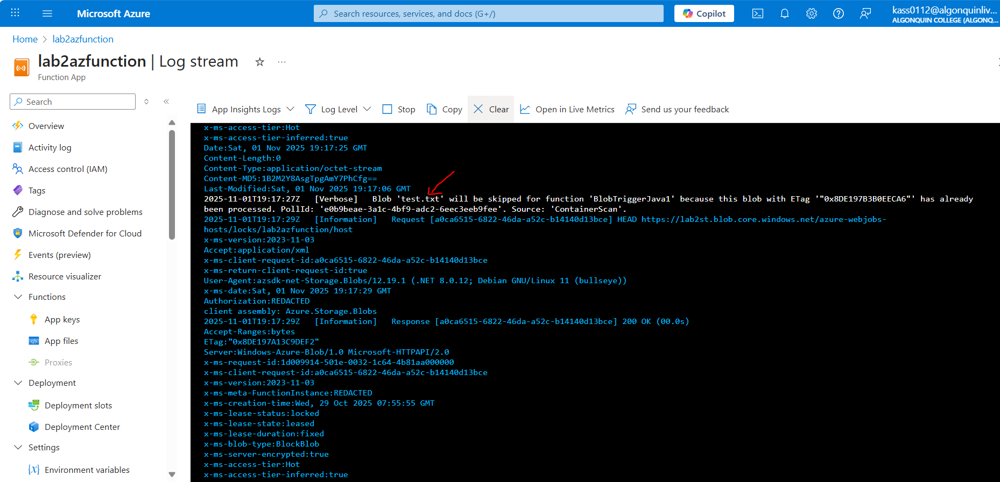
    - successfull invocations
    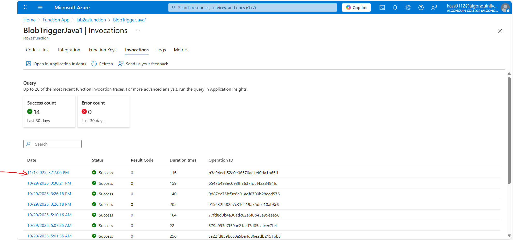
    - successfull metrics
    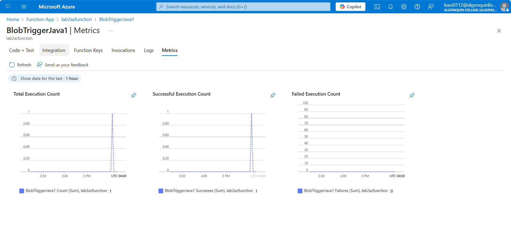

- Copy the bottom output log and paste in word doc 
    - [Log file](<Log file - Anani Kassa.docx>)

### Step 5: Screenshot of your resource group service and no resources underneath the resource group
  - Before deletion
    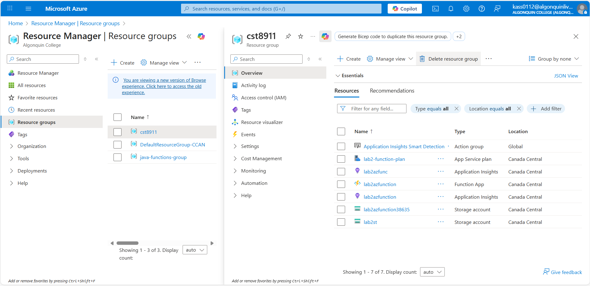

  - After deletion
  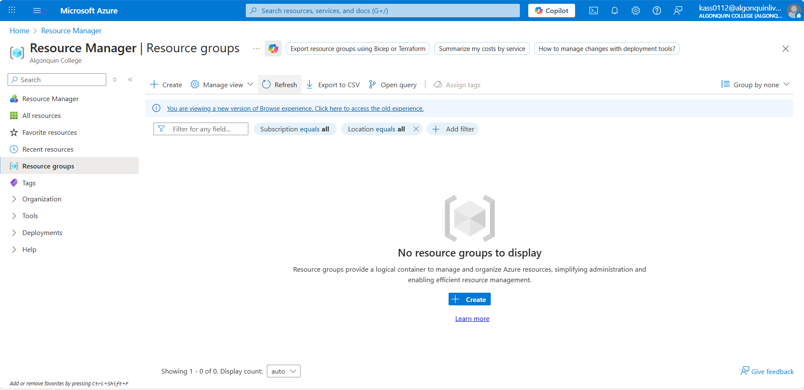