## About me 
### Full name: Anani Thierry Kassa
### Student ID: 041140713

# Lab #4: Alerts and Automation Accounts

## Step 1:

- Include screenshots that display each of those settings being selected and the virtual machine being created
    - Basics
    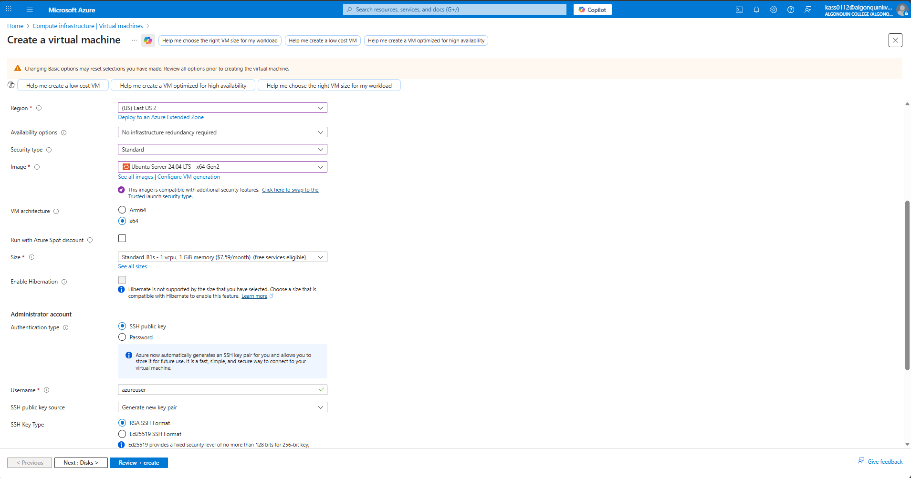
    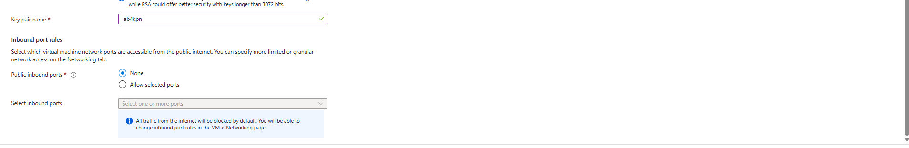

    - Disk
    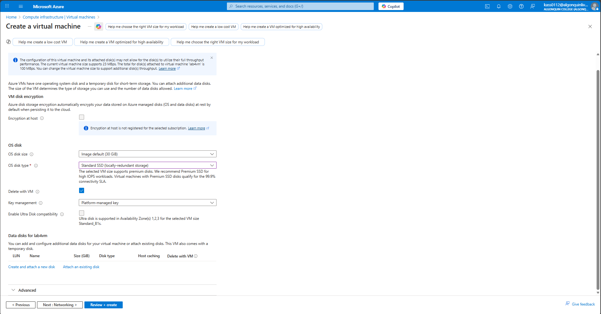

    - Network
    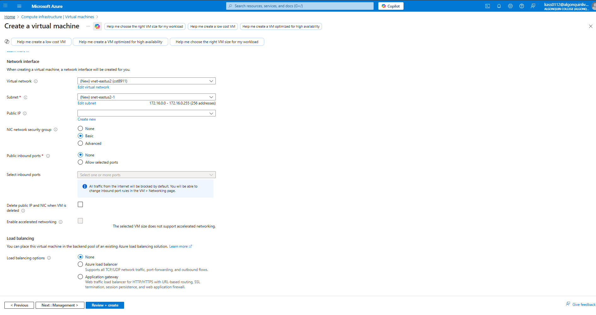

    - Tags
    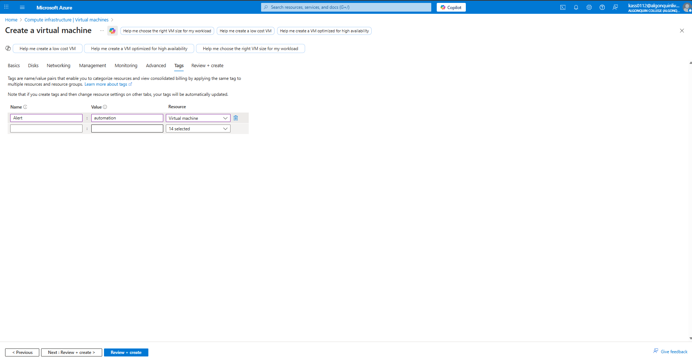

## Step 2:

- Include screenshots of alert rule being created for the virtual machine, with logical aggregation type, operator, threshold value and checks. 
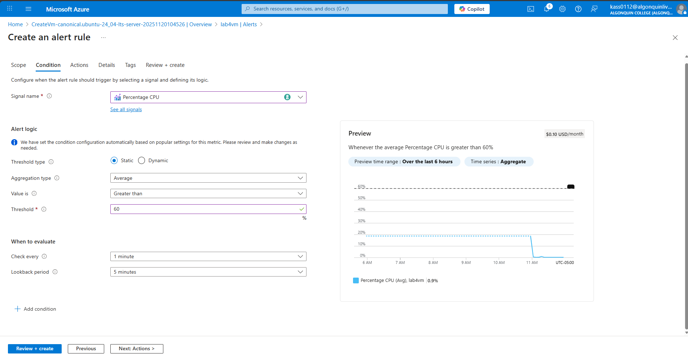

- Also, include the screenshots of the action group being created in the correct region, and selecting the correct action group which has a built-in functionality that will let you stop the virtual machine.
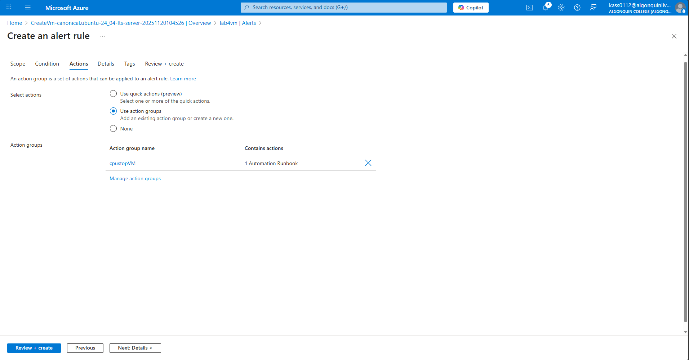
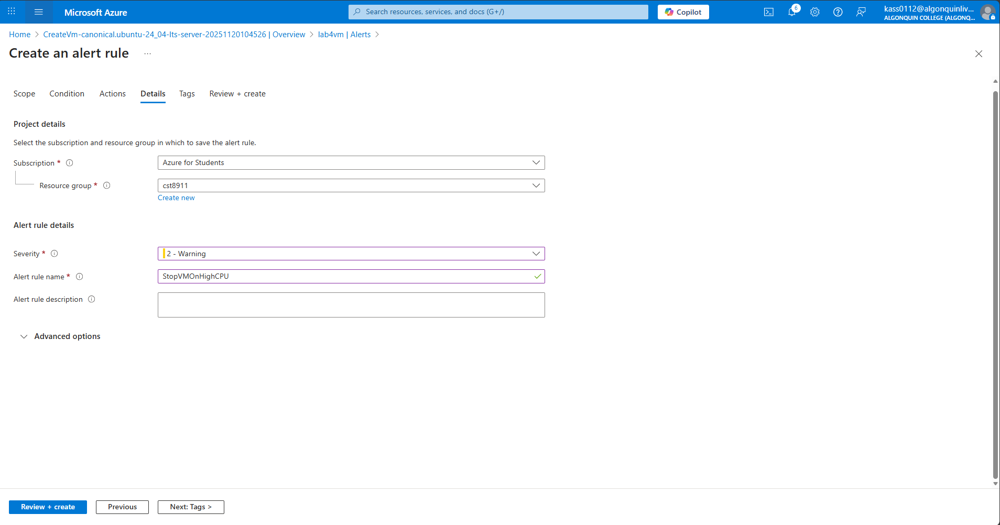

## Step 3:

- Include screenshots showing you have created the automation account in the same region as all other resources (East US 2)
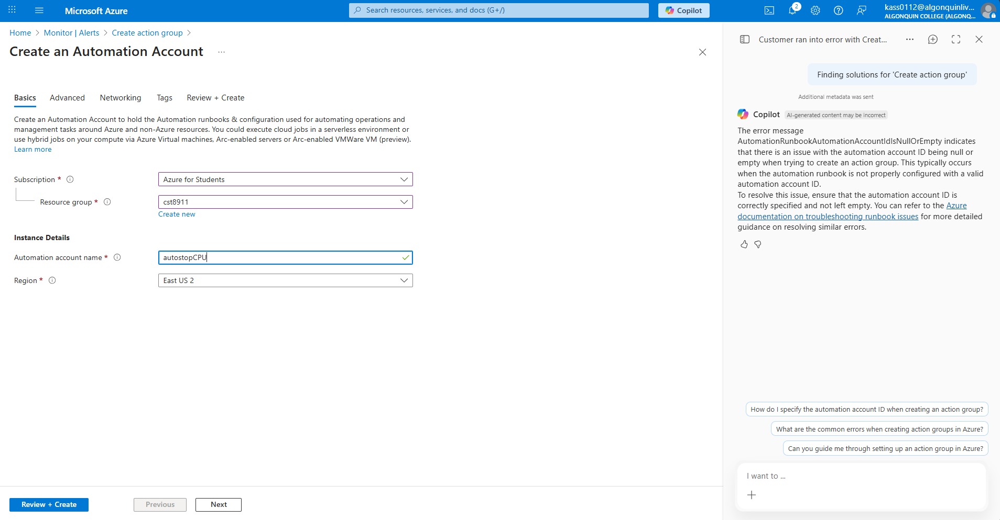
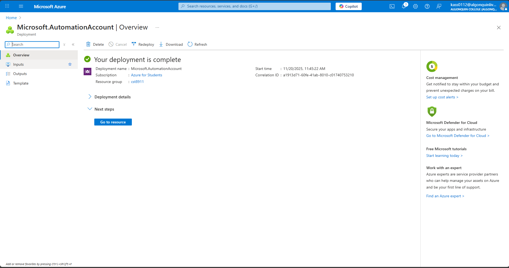

## Step 4:

Include screenshots displaying the creation of a runbook that uses powershell 5.1  as the runtype and version.
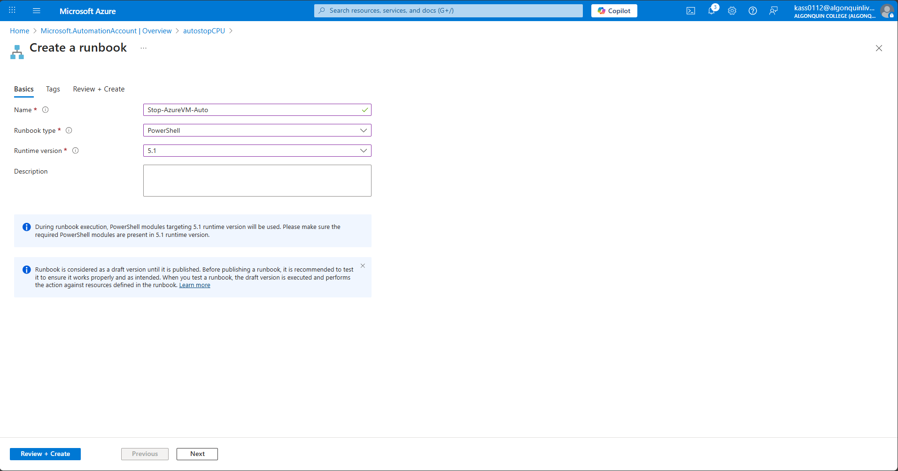

## Step 5:

- Include screenshots of the final code, 
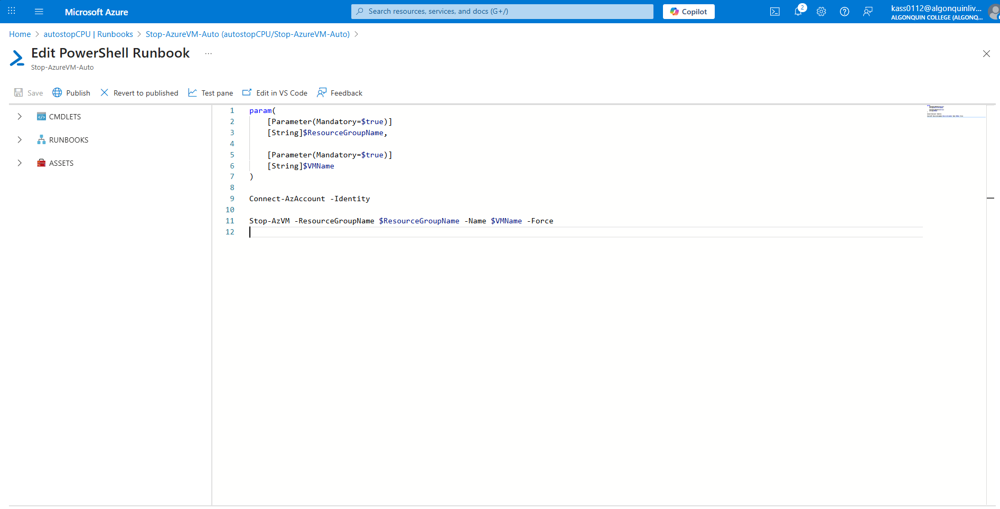

- of your selecting test pane and testing the code to see if it works and stops the virtual machine, 
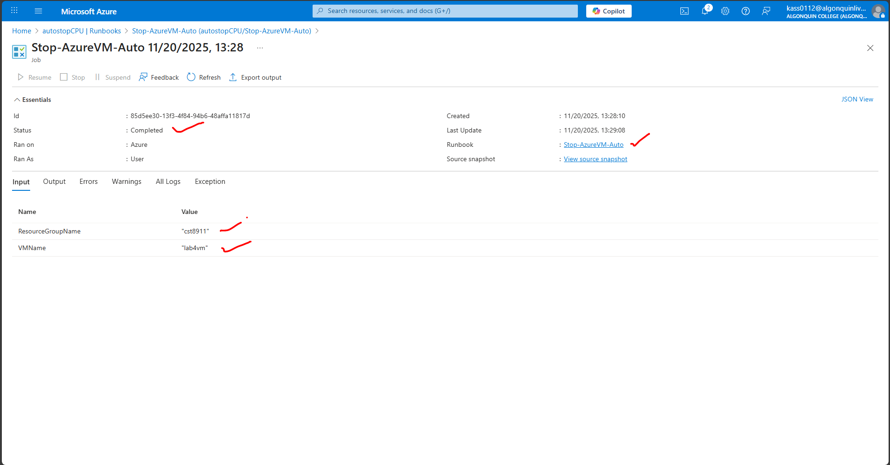
- and final screenshot of the stopped virtual machine you created in step 1
    - VM status before running the runbook
    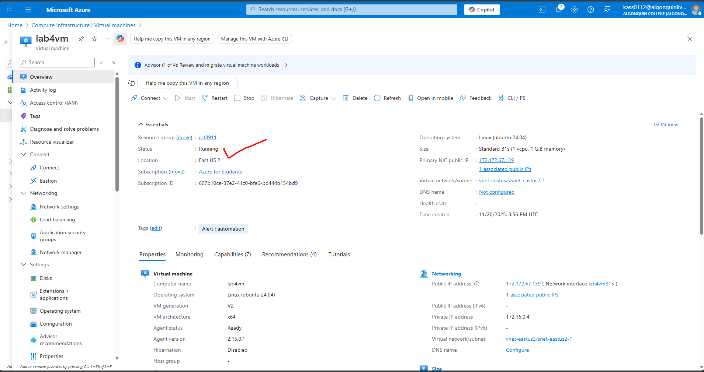

    - VM status after running the runbook
    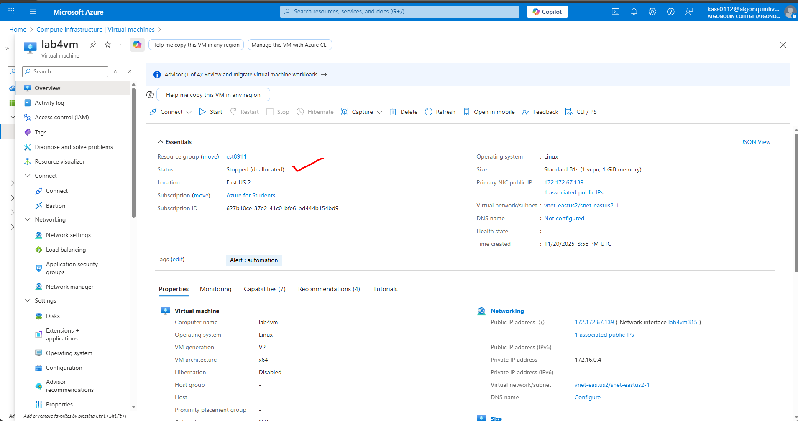

## Step 6:

Screenshot showing resources have all been deleted or just delete resource group
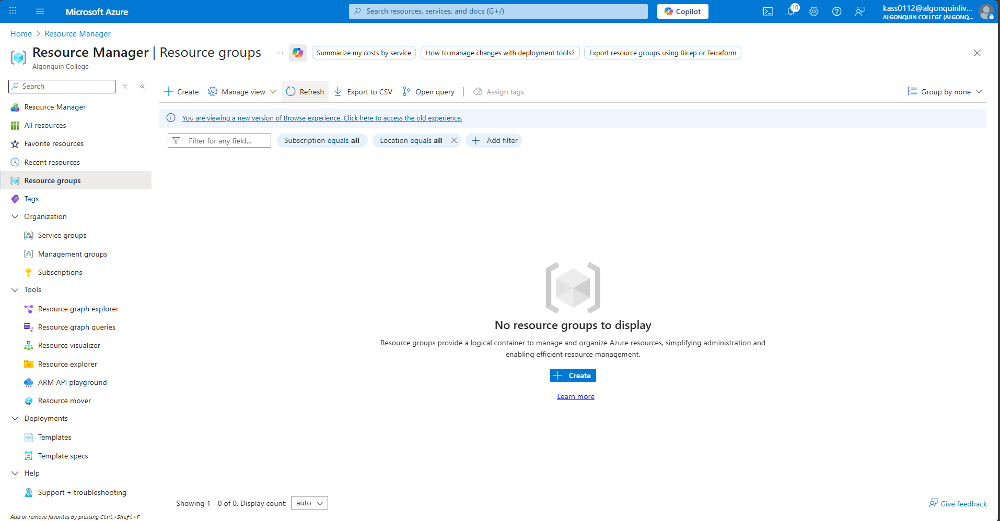