## About me 
### Full name: Anani Thierry Kassa
### Student ID: 041140713

### Step 1:
- Screenshots must include each step of the creation of the azure SQL database and server specifically focused on the of workload environment, and if the right checkboxes were selected to allow both SQL and Microsoft Entra authentication. Any additional settings that are relevant that would allow you to sign in and any permissions that might need to be given to allow you to login for step 2, should also be included.

1. create a resource group in az portal
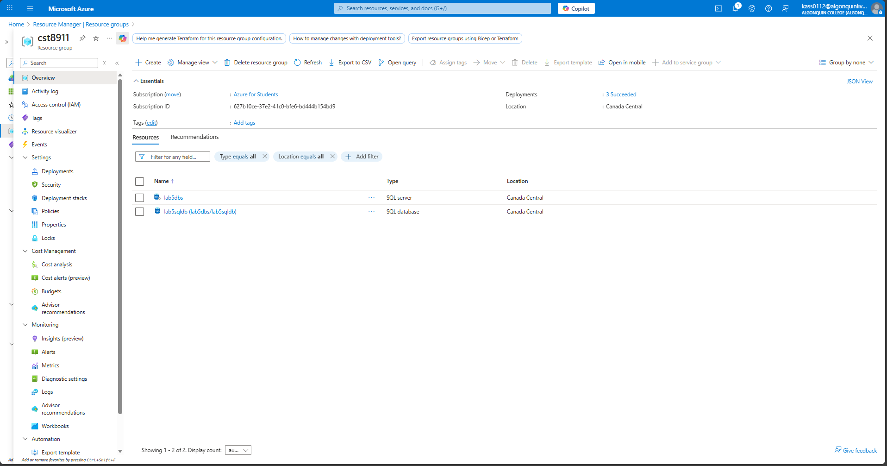
2. create a SQL Database Server 
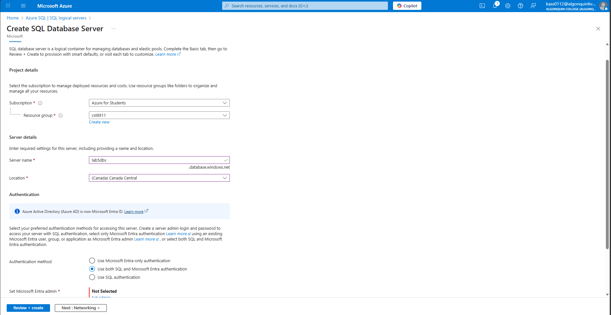
3. set Microsoft Entra Admin
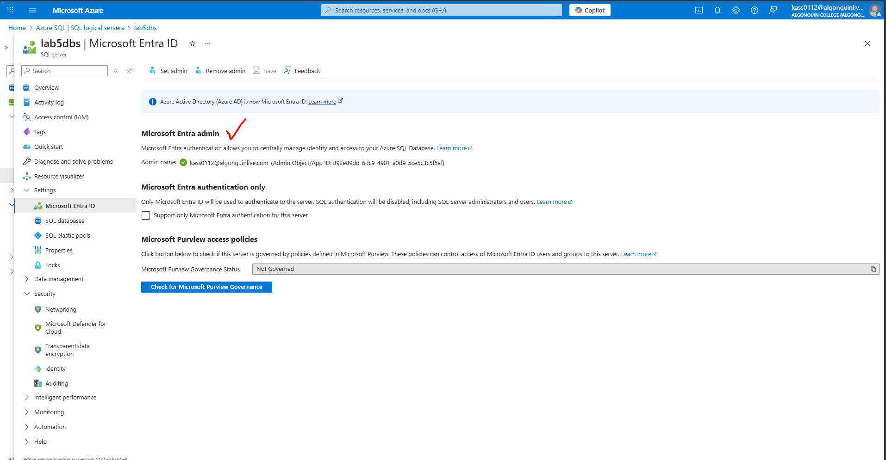
4. Configure Networking by enabling Public network access
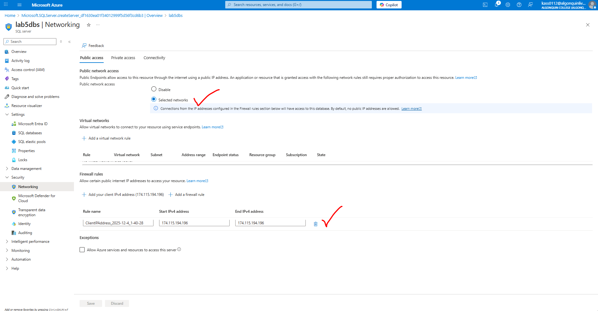
5. create SQL Database
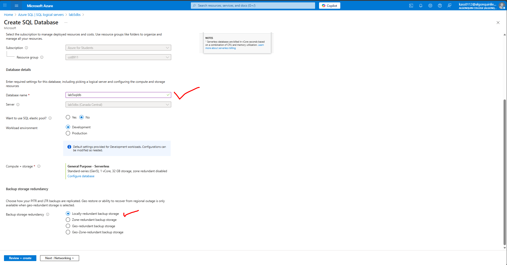

### Step 2:

1. Screenshot of the credentials being inputted to sign in via SQL login(username and password) 
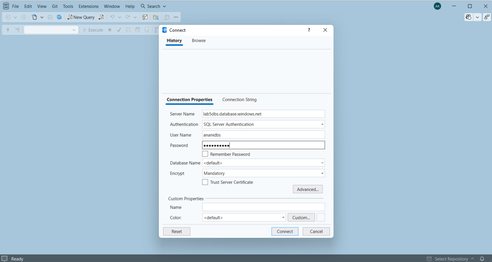
2. and following result that you were able to sign in being shown as well
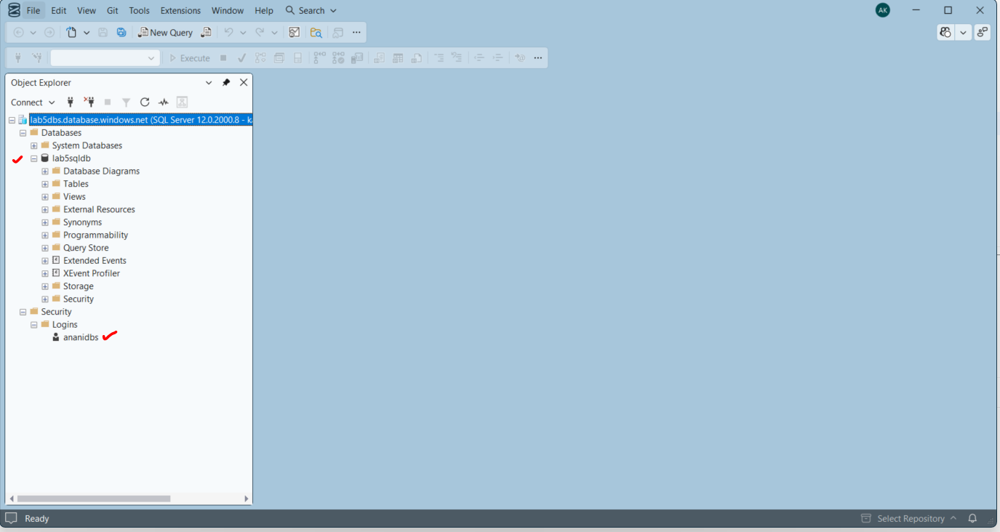

3. Screenshot of the credentials being inputted to sign in via Microsoft Entra ie authentication 
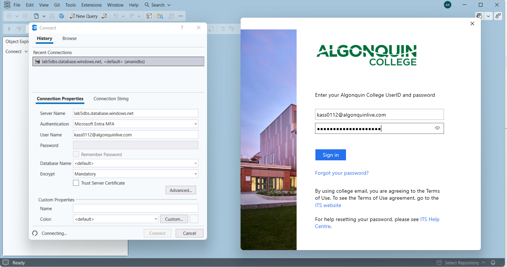

- MFA authentication
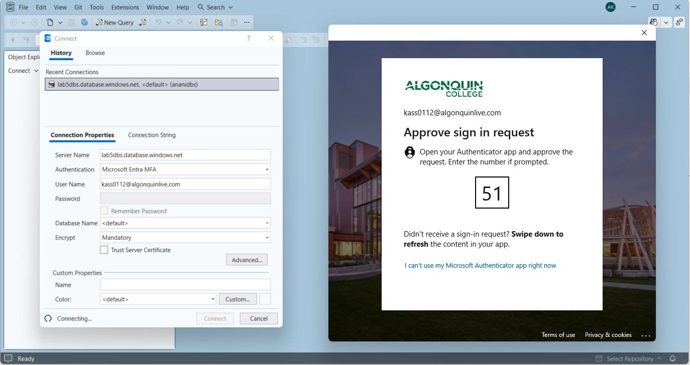

4. and following result that you were able to sing in being shown as well
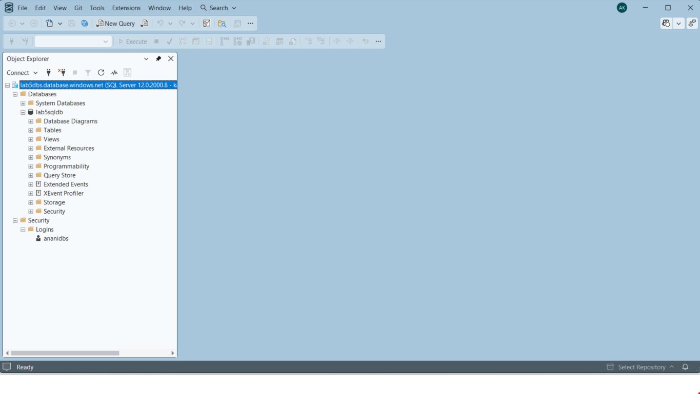

### Step 3:
- Screenshot of all resources being deleted
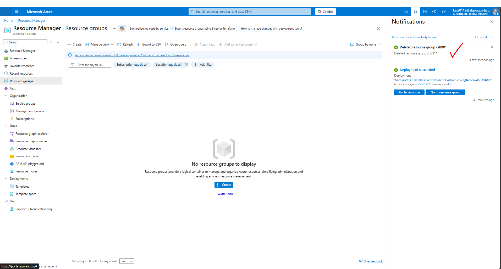