# About me 
### Full name: Anani Thierry Kassa
### Student ID: 041140713

## Step 1:

Attach your json custom template as a separate file

Screenshot showing successful deployment from the custom template
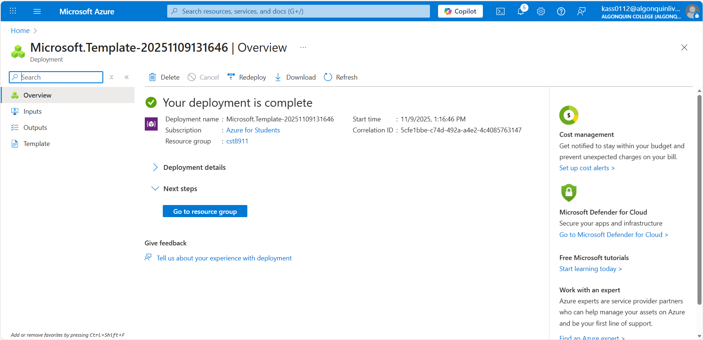

So I can verify that the virtual machine from the json template was created. 
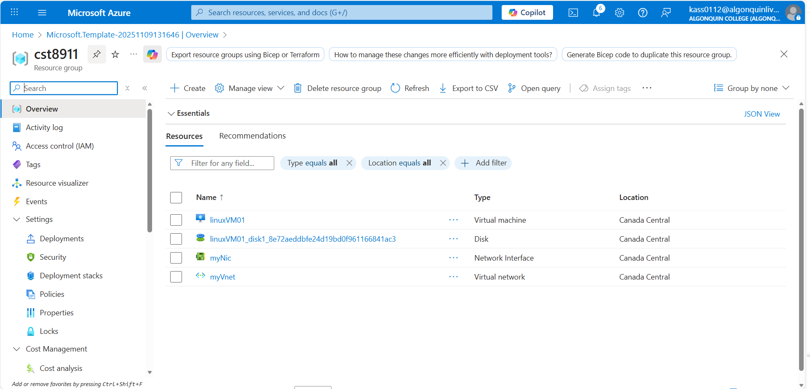
Screenshots should include verifications of each of the settings in step 1, so the screenshots should show the virtual machine once it is created and its settings ensure you display the:
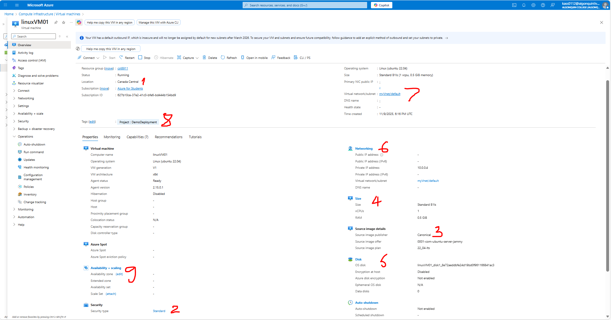

- 1- Region
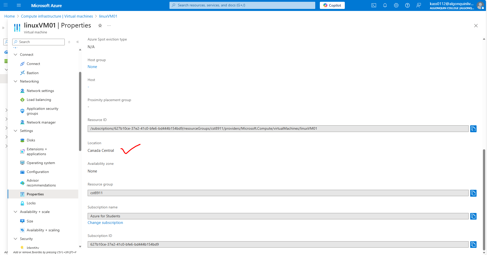
- 2- Security Type
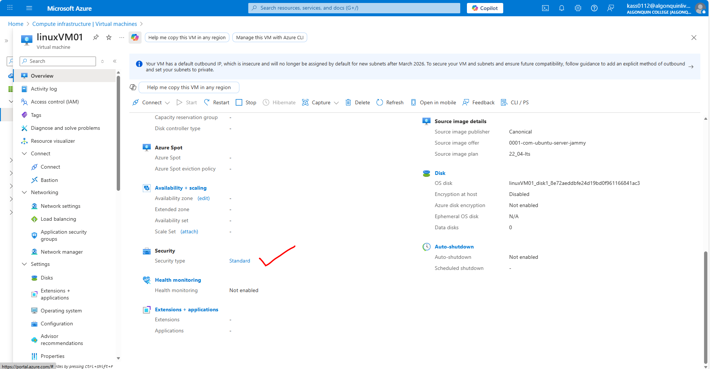
- 3- Image
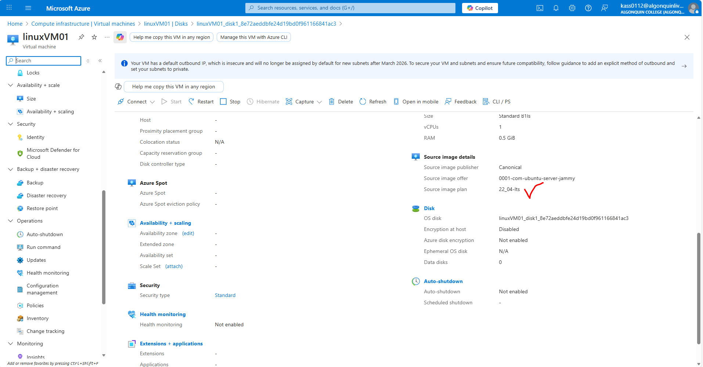
- 4- Size
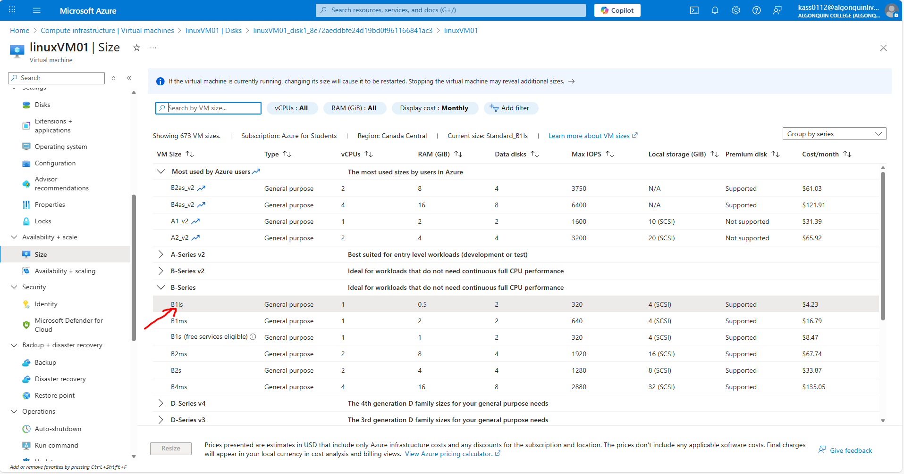
- 5- Os Disk type
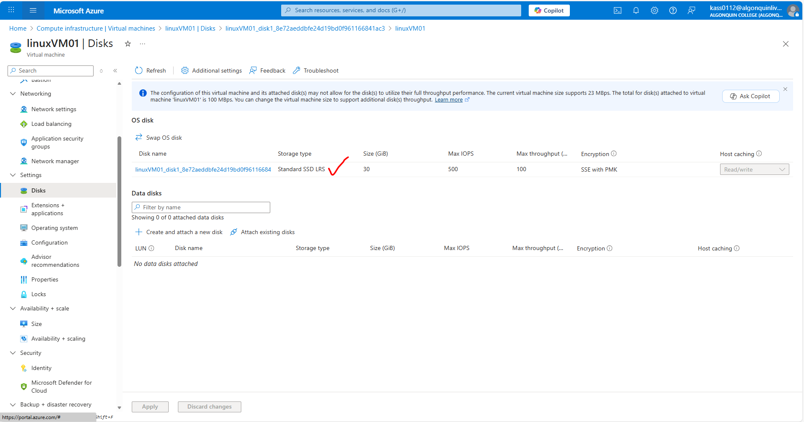
- 6- Public inbound ports
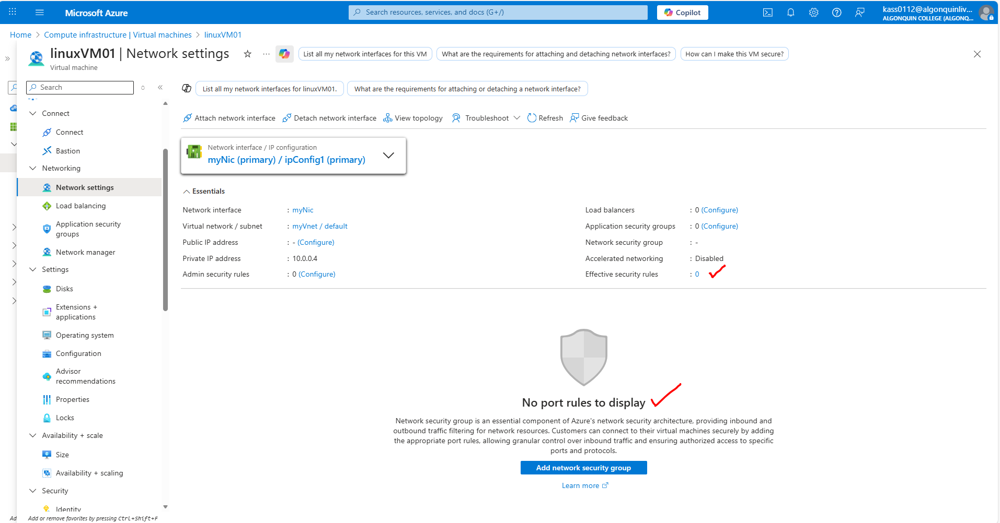
- 7- virtual network
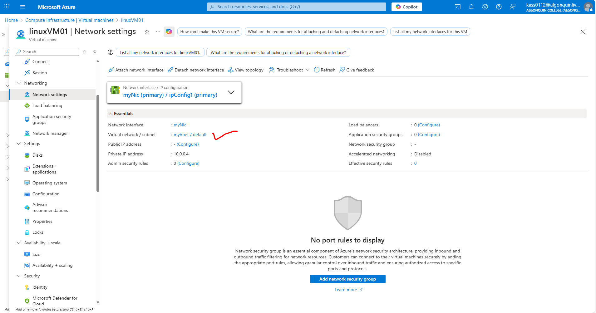
- 8- tag that was created
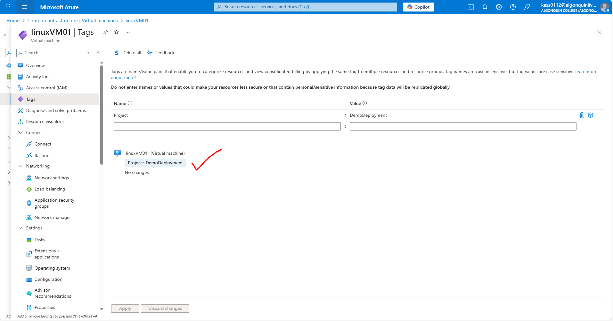
- 9- Availability Options
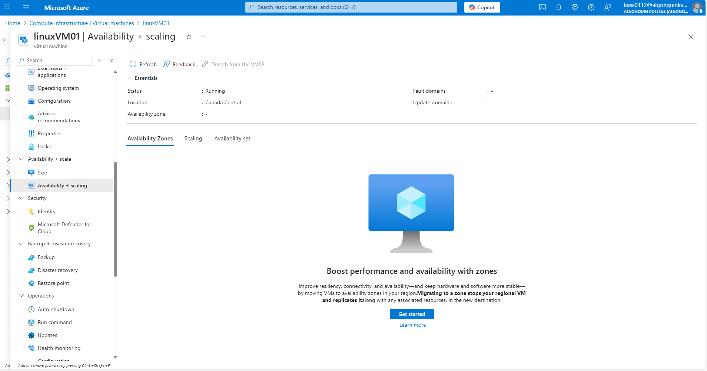
- 10- Load balancing options

## Step 2:

Screenshot showing that all resources were deleted
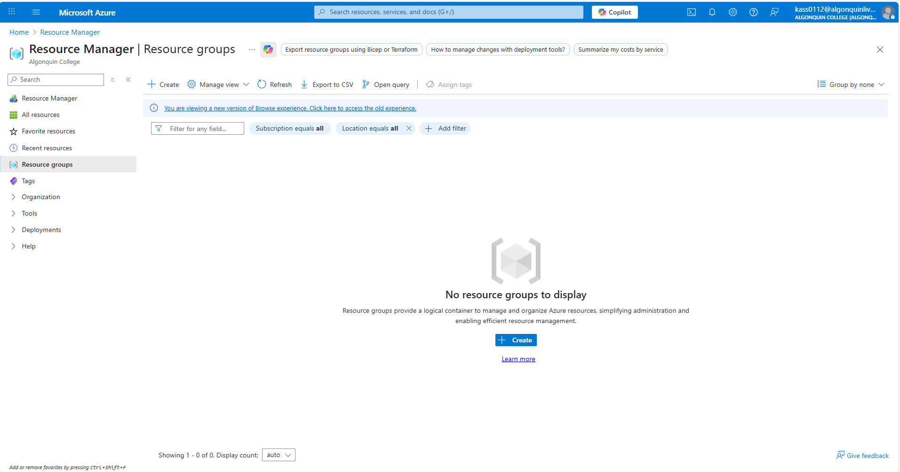